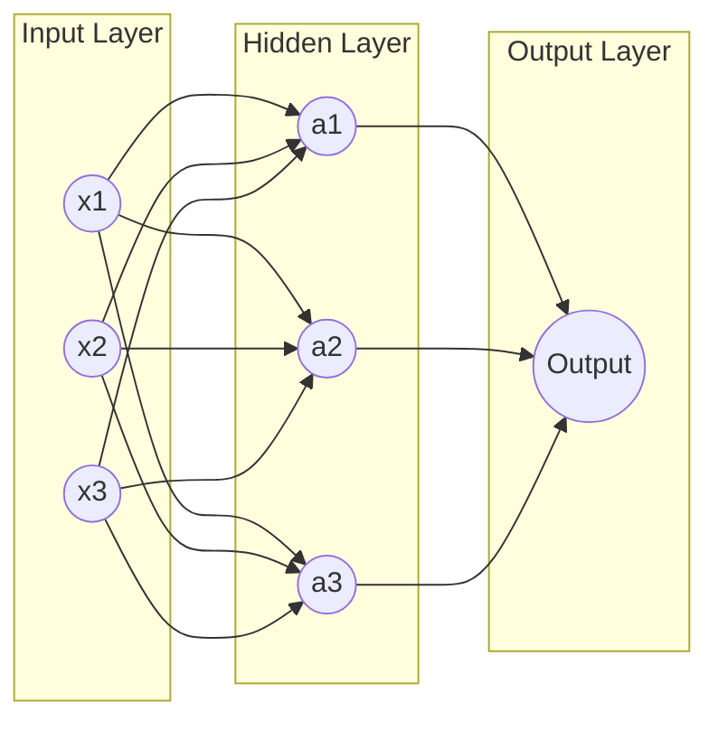

# Core Notes

## Table of Contents
1.  [Introduction to Neural Networks](#key-concept-1-introduction-to-neural-networks)
2.  [Model Representation](#key-concept-2-model-representation)
3.  [Activation Functions](#key-concept-3-activation-functions)
4.  [Forward Propagation](#key-concept-4-forward-propagation)

* **My Legend:**
    * 🔑 **Key Definition:** For critical, must-know vocabulary.
    * ❓ **Question:** For things you don't understand or want to explore later.
    * 🔗 **Connection:** For links to your existing knowledge.
    * 💡 **Insight:** For "aha!" moments or key takeaways.
    * ⚠️ **Warning:** For common mistakes, pitfalls, or important limitations.

---

## Key Concept 1: Introduction to Neural Networks

-   🔑 **Key Definitions:**
    -   **Neural Network:** A powerful machine learning model inspired by the structure of the human brain. It consists of interconnected nodes (neurons) organized in layers.
    -   **Neuron:** A single computational unit in a neural network that takes multiple inputs, performs a calculation, and produces an output.
-   💡 **Insight:** Neural networks are capable of learning very complex, non-linear relationships in data, which is why they are so powerful for tasks like image recognition and natural language processing.
-   🔗 **Connection:** A single neuron in a neural network is very similar to a logistic regression unit. A neural network is essentially a collection of these neurons stacked together in layers.

### Visualizing a Simple Neural Network


## Key Concept 2: Model Representation

-   🔑 **Key Definitions:**
    -   **Input Layer:** The first layer of a neural network that receives the input features.
    -   **Hidden Layer:** Any layer between the input and output layers. These layers are responsible for learning the complex patterns in the data.
    -   **Output Layer:** The final layer of a neural network that produces the output prediction.
    -   **Activation Function:** A function applied to the output of a neuron that introduces non-linearity into the model.
-   ❓ **Questions:**
    -   How do you choose the number of hidden layers and the number of neurons in each layer? (This is a key challenge in deep learning, often determined through experimentation).

## Key Concept 3: Activation Functions

-   🔑 **Key Definitions:**
    -   **Sigmoid:** An activation function that squashes its input to a range between 0 and 1. `g(z) = 1 / (1 + e⁻ᶻ)`.
    -   **ReLU (Rectified Linear Unit):** A popular activation function that outputs the input directly if it is positive, and zero otherwise. `g(z) = max(0, z)`.
-   💡 **Insight:** ReLU is often the default choice for hidden layers because it is computationally efficient and helps to mitigate the "vanishing gradient" problem.
-   ⚠️ **Warnings:**
    -   The sigmoid function can suffer from the vanishing gradient problem, where the gradients become very small, making it difficult for the network to learn.

### Python Implementation
```python
import numpy as np

def sigmoid(z):
    """
    Compute the sigmoid of z
    """
    return 1 / (1 + np.exp(-z))

def relu(z):
    """
    Compute the ReLU of z
    """
    return np.maximum(0, z)
```

## Key Concept 4: Forward Propagation

-   🔑 **Key Definitions:**
    -   **Forward Propagation:** The process of passing input data through the neural network from the input layer to the output layer to generate a prediction.
-   💡 **Insight:** Forward propagation is essentially a series of matrix multiplications and applications of activation functions as the data flows through the network. Each layer's output becomes the next layer's input.

---

# Module Summary

*(After finishing the module, write a 3-5 sentence summary here from memory **before** reviewing your notes above. This is a critical step for retention.)*

This week introduced the fundamental building blocks of neural networks. I learned about the basic architecture, including input, hidden, and output layers, and the role of individual neurons. A key concept was the activation function, which introduces non-linearity, with a focus on the Sigmoid and ReLU functions. The process of making predictions with a neural network, known as forward propagation, was also covered, which involves passing data through the network layer by layer.
