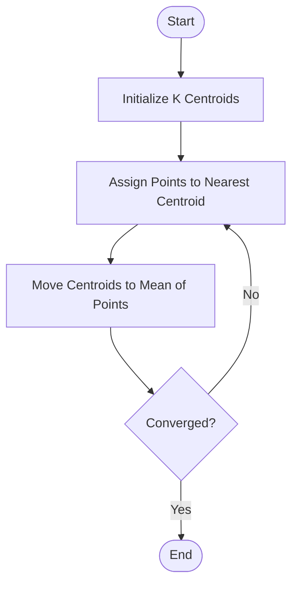

# Core Notes

## Table of Contents
1.  [Introduction to Unsupervised Learning](#key-concept-1-introduction-to-unsupervised-learning)
2.  [Clustering](#key-concept-2-clustering)
3.  [K-Means Algorithm](#key-concept-3-k-means-algorithm)
4.  [K-Means Cost Function](#key-concept-4-k-means-cost-function)

* **My Legend:**
    * 🔑 **Key Definition:** For critical, must-know vocabulary.
    * ❓ **Question:** For things you don't understand or want to explore later.
    * 🔗 **Connection:** For links to your existing knowledge.
    * 💡 **Insight:** For "aha!" moments or key takeaways.
    * ⚠️ **Warning:** For common mistakes, pitfalls, or important limitations.

---

## Key Concept 1: Introduction to Unsupervised Learning

-   🔑 **Key Definitions:**
    -   **Unsupervised Learning:** A type of machine learning where the algorithm learns from unlabeled data. The goal is to find patterns, structure, or relationships in the data without any pre-existing labels.
-   💡 **Insight:** Unsupervised learning is often used for data exploration and can be a precursor to a supervised learning task. For example, you could use clustering to identify different customer segments and then build a separate prediction model for each segment.
-   🔗 **Connection:** Unlike supervised learning, there is no "right answer" or output label for the algorithm to learn from.

## Key Concept 2: Clustering

-   🔑 **Key Definitions:**
    -   **Clustering:** The task of grouping a set of objects in such a way that objects in the same group (called a cluster) are more similar to each other than to those in other groups.
-   ❓ **Questions:**
    -   What are some real-world applications of clustering? (Customer segmentation, social network analysis, astronomical data analysis).

## Key Concept 3: K-Means Algorithm

-   🔑 **Key Definitions:**
    -   **K-Means:** An iterative clustering algorithm that aims to partition n observations into k clusters in which each observation belongs to the cluster with the nearest mean.
    -   **Cluster Centroid:** The center of a cluster, calculated as the mean of all the points in the cluster.
-   💡 **Insight:** The K-Means algorithm is simple and computationally efficient, making it a popular choice for clustering tasks.

### Visualizing K-Means Algorithm

-   ⚠️ **Warnings:**
    -   The number of clusters, K, must be specified beforehand.
    -   The algorithm is sensitive to the initial placement of centroids. It's common to run K-Means multiple times with different random initializations and choose the result with the lowest cost.

## Key Concept 4: K-Means Cost Function

-   🔑 **Key Definitions:**
    -   **Cost Function (Distortion):** In K-Means, the cost function is the sum of the squared distances between each data point and its assigned cluster centroid. The goal is to minimize this cost.
-   💡 **Insight:** The cost function helps us to evaluate the quality of our clustering. A lower cost means that the points are closer to their cluster centroids, resulting in a better clustering.

---

# Module Summary

*(After finishing the module, write a 3-5 sentence summary here from memory **before** reviewing your notes above. This is a critical step for retention.)*

This week introduced the paradigm of unsupervised learning, where the goal is to find hidden patterns in unlabeled data. The primary focus was on clustering, a common unsupervised learning task. I learned about the K-Means algorithm, an iterative method for partitioning data into a predefined number of clusters (K). The importance of the cost function (distortion) in evaluating the quality of the clustering and the sensitivity of K-Means to initial centroid placement were also key takeaways.
